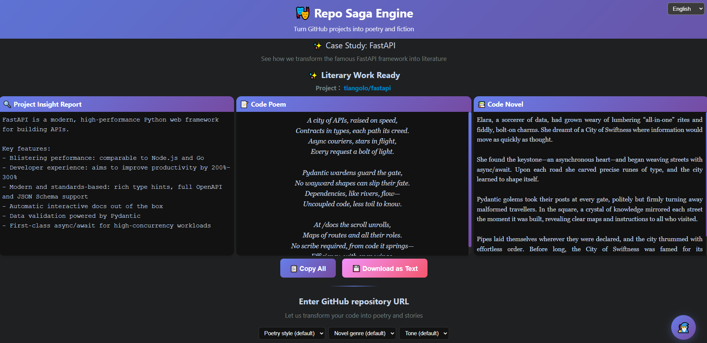

# Repo Saga Engine 🎭

A magical engine that transforms GitHub projects into poetry and fiction. Automatically generates creative literary works by analyzing code structure and content.



## Project Overview

Repo Saga Engine is a full-stack application that includes:
- **Backend (FastAPI)**: Provides API services, analyzes GitHub projects and generates literary works
- **Frontend (Vue 3 + Vite)**: User interface for project input and result display

## Project Structure

```
.
├── repo-saga-backend/          # Backend service (FastAPI)
│   ├── app/
│   │   ├── main.py            # FastAPI main application
│   │   └── services.py        # Business logic services
│   ├── requirements.txt       # Python dependencies
│   └── test_generate_api.py   # API tests
├── repo-saga-frontend/         # Frontend application (Vue 3)
│   ├── src/
│   │   ├── App.vue           # Main application component
│   │   ├── components/       # Vue components
│   │   └── services/         # API services
│   ├── package.json          # Node.js dependencies
│   └── vite.config.js        # Vite configuration
└── README.md                 # Project documentation
```

## Features

- 🔍 **Intelligent Analysis**: Deep analysis of GitHub project code structure and content
- 📊 **Insight Reports**: Generate technical insights and analysis reports for projects
- 🎨 **Poetry Creation**: Transform code logic into beautiful poetry
- 📚 **Novel Generation**: Create engaging novel excerpts based on project characteristics
- 🌐 **Modern Interface**: Responsive Vue 3 frontend with horizontal three-column layout design
- ⚡ **High Performance**: FastAPI backend provides fast API responses
- 🧙‍♂️ **AI Chat Assistant**: Personified magical assistant providing programming advice and creative inspiration
- 📱 **Optimized Experience**: Responsive layout design with independent scrolling for three columns, maximizing screen space utilization

## Quick Start

### Requirements

- **Python**: 3.8+
- **Node.js**: 20.19.0+ or 22.12.0+
- **npm**: Latest version

### 1. Clone the Project

```bash
git clone <your-repo-url>
cd <project-directory>
```

### 2. Start Backend Service

```bash
# Enter backend directory
cd repo-saga-backend

# Install Python dependencies
pip install -r requirements.txt

# Start FastAPI server
uvicorn app.main:app --reload --host 0.0.0.0 --port 8000
```

The backend service will start at `http://localhost:8000`

### 3. Start Frontend Service

Open a new terminal window:

```bash
# Enter frontend directory
cd repo-saga-frontend

# Install Node.js dependencies
npm install

# Start development server
npm run dev
```

The frontend application will start at `http://localhost:5173`

### 4. Access the Application

Open `http://localhost:5173` in your browser to start using Repo Saga Engine!

## API Documentation

### Main Endpoints

- `GET /`: API welcome message
- `GET /example`: Get FastAPI example data
- `POST /generate`: Generate literary works

### Usage Example

```bash
# Generate literary works
curl -X POST "http://localhost:8000/generate" \
     -H "Content-Type: application/json" \
     -d '{"url": "https://github.com/tiangolo/fastapi"}'
```

### API Documentation

After starting the backend service, you can access:
- Swagger UI: `http://localhost:8000/docs`
- ReDoc: `http://localhost:8000/redoc`

## Development Guide

### Backend Development

```bash
cd repo-saga-backend

# Install dependencies
pip install -r requirements.txt

# Run tests
python test_generate_api.py

# Start development server
uvicorn app.main:app --reload
```

### Frontend Development

```bash
cd repo-saga-frontend

# Install dependencies
npm install

# Development mode
npm run dev

# Build production version
npm run build

# Preview production version
npm run preview
```

## Technology Stack

### Backend
- **FastAPI**: Modern, fast Python web framework
- **Uvicorn**: ASGI server
- **Requests**: HTTP request library
- **Python-dotenv**: Environment variable management

### Frontend
- **Vue 3**: Progressive JavaScript framework
- **Vite**: Next-generation frontend build tool
- **Axios**: HTTP client
- **CSS3**: Modern style design

## Deployment

### Production Environment Deployment

1. **Backend Deployment**:
```bash
cd repo-saga-backend
pip install -r requirements.txt
uvicorn app.main:app --host 0.0.0.0 --port 8000
```

2. **Frontend Deployment**:
```bash
cd repo-saga-frontend
npm install
npm run build
# Deploy the dist/ directory to a static file server
```

## Contributing

1. Fork this project
2. Create a feature branch (`git checkout -b feature/AmazingFeature`)
3. Commit your changes (`git commit -m 'Add some AmazingFeature'`)
4. Push to the branch (`git push origin feature/AmazingFeature`)
5. Open a Pull Request

## License

This project is licensed under the MIT License - see the [LICENSE](LICENSE) file for details.

## Contact

If you have questions or suggestions, please contact us through:
- Submit an Issue
- Send a Pull Request
- Contact project maintainers

---

**Turn code into poetry, transform projects into stories!** ✨
